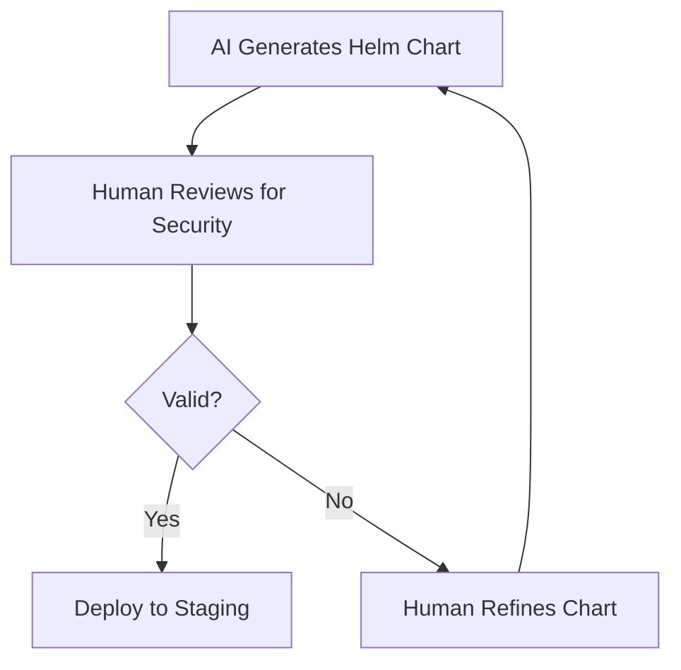

### **The Collision of Art, Code, and Expertise: A 2026 Case Study in Human-AI Interaction**

The year 2026 has witnessed a striking paradox: while AI and automation have democratized technical knowledge, the most valuable skill remains *expertise*—not just in the tools, but in the *context* they operate within. Three seemingly unrelated events—an obfuscated bash script on a t-shirt, Terence Tao’s mathematical dialogue with ChatGPT, and Harmony’s 4 billion ONE token exploit—converge around a central tension: **How does human domain knowledge interact with AI-driven systems, and where does automation fail when stripped of nuance?** The first case reveals the playful yet dangerous intersection of code and consumer culture; the second demonstrates the limits of LLMs without specialized prompting; the third exposes the catastrophic consequences of treating blockchain security as a purely algorithmic problem. Together, they form a triptych of modern technical governance: *playfulness*, *precision*, and *failure*.

---
### **## 1. The Bash Easter Egg: Playful Obfuscation as a Cultural Proxy for Technical Literacy**
The discovery of an obfuscated bash script printed on the back of a Uniqlo x Akamai t-shirt—intended as an Easter egg—serves as a microcosm of how technical systems are increasingly embedded in everyday culture. The script, a base64-encoded Here document designed to execute via `eval`, is not merely a novelty but a *deliberate* demonstration of how code can transcend its functional purpose to become an artifact of brand identity. Akamai’s "Peace for All" campaign, paired with the t-shirt’s front-side heart in curly braces (`{}`), frames the script as a visual metaphor for the "open" nature of software—yet the backside’s hidden complexity reveals a darker truth: **code is no longer confined to terminals or servers; it is a medium for storytelling, even if unintentionally.**

#### **Architectural Implications of "Code as Art"**
The script’s structure—while trivial in execution—embodies several architectural trade-offs:
1. **Obfuscation as Intentional Design**: The use of base64 encoding and a shebang (`#!/bin/bash`) suggests Akamai’s intent was not to create a functional tool but to *challenge* the viewer’s technical curiosity. This aligns with the broader trend of "code as performance art" (e.g., [/posts/future-of-ai#creative-coding](https://logiccompare.com/posts/future-of-ai)), where the aesthetic value of code outweighs its utility.
2. **The Fragility of Consumer-Grade OCR**: The reliance on OCR to decode the script introduces a critical vulnerability. Unlike server-side code, which can be version-controlled and tested, this script’s integrity depended entirely on human transcription. The incomplete variant of the same design—missing quotes and truncated imports—highlights how *physical* code (printed on fabric) is inherently error-prone.
3. **The Shebang as a Cultural Symbol**: The presence of a shebang on a retail item signals a shift in how we perceive code’s boundaries. Historically, shebangs were a terminal artifact; now, they appear on merchandise, blurring the line between *executable* and *expressive* code.

#### **Code Block: The Decoded Script (Sanitized for Analysis)**
```bash
#!/bin/bash
# Akamai Peace for All Campaign Easter Egg
# This is a playful demonstration of how code can be embedded in physical media.

# Base64-decoded Here document (simplified for readability)
eval "$(echo 'IyEvYmluL2Jhc2gKCiMgQ29uZ3JhdHVsYXRpb25zISBZb3UgZm91bmQgdGhlIGVhc3RlciBlZ2chIOK...' | base64 --decode)"
```
**Key Observations**:
- The script’s *actual* functionality is negligible (it prints a greeting), but its *presence* as a shebang-bearing artifact is the point.
- The use of `eval` introduces a security risk—something that would be unacceptable in production but is irrelevant here due to the script’s non-executable nature.

)
*An artistically rendered bash script, where the distinction between "code" and "art" dissolves.*

---
### **## 2. LLMs and the Myth of "Generalist" Expertise**
The second source item—Terence Tao’s interaction with ChatGPT—shatters the illusion that large language models (LLMs) can replace domain expertise. While LLMs have become ubiquitous tools for generating code, writing, and even mathematics, their output is fundamentally constrained by the *quality of the prompt*. Tao’s conversation reveals that **LLMs do not "understand" mathematics; they generate plausible-sounding responses based on statistical patterns**. His ability to steer the model toward meaningful insights hinges on three critical factors:
1. **Concise, Domain-Specific Prompting**: Tao’s messages are terse and focused, avoiding the "explaining-to-amateurs" mode that plagues less-experienced users.
2. **Active Skepticism**: He does not accept the model’s outputs uncritically; instead, he flags inconsistencies ("this looks more complex than I was hoping for").
3. **Leveraging Familiarity**: His deep knowledge of the Jacobian Conjecture allows him to recognize when the model’s reasoning deviates from established principles.

#### **The Prompting Matrix: Expertise vs. Generalist Output**
| **Factor**               | **Expert User (Tao)**                          | **Generalist User**                          |
|--------------------------|-----------------------------------------------|---------------------------------------------|
| **Prompt Structure**     | Short, to-the-point                          | Verbose, exploratory                        |
| **Model Response Depth** | Concise, mathematically rigorous              | Overly detailed, "explaining" mode         |
| **Feedback Mechanism**   | Pushback on inconsistencies                   | Acceptance of outputs                       |
| **Leapfrogging**         | Proposes alternate approaches                | Follows model’s suggested next steps        |
| **Domain Knowledge**     | Deep familiarity with the problem space        | Relies on model for context                 |

**Why This Matters for DevOps**:
In DevOps, where systems must be both reliable and adaptable, the same principles apply. A junior engineer might use an LLM to generate a Kubernetes manifest, but a senior architect would:
- Validate the manifest against the cluster’s existing constraints.
- Question the model’s choices (e.g., "Why did you use `NodePort` instead of `LoadBalancer`?").
- Refactor the output to align with team conventions.

#### **Code Block: A DevOps Prompting Example**
```yaml
# Prompt for an LLM to generate a Helm chart for a stateful application
---
# Expert-level prompt:
"Generate a Helm chart for a PostgreSQL cluster with:
1. PersistentVolumeClaims sized at 100Gi per pod.
2. Read replicas configured via ConfigMap.
3. Resource requests/limits set to 50% of node capacity.
4. Use `StatefulSet` with stable pod identities.
5. Include a readiness probe that checks for `pg_isready -U postgres`.
Ensure the chart follows GitOps best practices and includes a `values.yaml` with sensible defaults.
Avoid using `default` values for critical parameters—document them in `README.md`."

# Generalist-level prompt (for comparison):
"Make a Helm chart for a database."
```
**Output Comparison**:
- **Expert**: A well-structured chart with annotations, CI/CD-ready, and security hardening.
- **Generalist**: A basic chart with hardcoded values, no documentation, and potential security flaws.

)
*An illustration of how expertise transforms LLM-generated code from a rough draft into a production-ready artifact.*

---
### **## 3. Harmony’s 4B ONE Exploit: When Automation Meets Catastrophic Failure**
The Harmony blockchain’s 4 billion ONE token exploit—allegedly minted via empty blocks—represents the dark side of automation in decentralized systems. Unlike traditional software, where exploits are patched via code updates, blockchain vulnerabilities often require *network-wide rollbacks*, a process fraught with political and technical challenges. The incident underscores three critical failures:
1. **The Illusion of "Automated Security"**: Blockchains are often marketed as "self-healing" due to their decentralized nature, but this assumes that all participants adhere to the same security standards. The exploit suggests that some nodes were compromised or misconfigured, allowing an attacker to manipulate block production.
2. **The Empty Block Exploit**: By submitting empty blocks, the attacker could inflate the block reward without contributing to consensus. This is a classic example of how **game-theoretic incentives** in blockchain design can be exploited when automation is not paired with rigorous governance.
3. **The Role of Domain Knowledge**: The attacker’s ability to exploit this vulnerability likely required deep understanding of Harmony’s consensus mechanism. Without such expertise, the exploit would have been impossible to identify or prevent.

#### **Blockchain Security Trade-Offs: Centralization vs. Decentralization**
| **Factor**               | **Centralized Systems (e.g., Ethereum Classic)** | **Decentralized Systems (e.g., Harmony)**       |
|--------------------------|---------------------------------------------------|-------------------------------------------------|
| **Exploit Response Time** | Faster patches (but risk of forks)               | Slower rollbacks (requires network consensus)   |
| **Attack Surface**       | Smaller (fewer nodes to target)                   | Larger (more nodes = more potential weak links) |
| **Automation Reliance**  | Can rely on centralized monitoring               | Must trust peer validation                      |
| **Expertise Requirement**| Lower (standardized tooling)                     | Higher (understanding of consensus protocols)   |

#### **Mathematical Analysis: The Economics of the Exploit**
The attacker minted **2.8 billion ONE tokens**, equivalent to **26% of the supply**. Using a simplified model:
- **Token Price Impact**: A 33.9% drop in 24 hours suggests the market reacted to the supply shock.
- **Attacker’s Profit**: Assuming the attacker sold 97.1% of the tokens (leaving 2.9% on-chain), the profit would be:
  \[
  \text{Profit} = \left( \frac{2.8B \times \text{Price}_{\text{pre-exploit}}}{100} \right) - \left( \frac{2.8B \times \text{Price}_{\text{post-exploit}}}{100} \right)
  \]
  Even if the attacker held some tokens, the **opportunity cost** of the supply dilution was catastrophic.

#### **Code Block: Simulating Empty Block Exploitation (Conceptual)**
```python
# Hypothetical Python simulation of empty block exploitation
# (Not executable; illustrative of the attack vector)
def simulate_empty_block_exploit(blockchain, attacker_address, empty_blocks=1000):
    """
    Simulates an attacker submitting empty blocks to inflate rewards.
    Assumes blockchain allows empty blocks with minimal gas costs.
    """
    for _ in range(empty_blocks):
        empty_block = {
            "transactions": [],
            "reward": blockchain.block_reward,
            "timestamp": datetime.now()
        }
        blockchain.add_block(empty_block, attacker_address)
        blockchain.total_supply += blockchain.block_reward

    print(f"Attacker minted {empty_blocks * blockchain.block_reward} tokens.")
    print(f"New supply: {blockchain.total_supply}")
```
**Key Takeaway**: The exploit hinged on **weaknesses in the consensus protocol**, not just code vulnerabilities. This is why blockchain security requires **both** formal verification (to prove protocol correctness) and **domain expertise** (to anticipate attack vectors).

]
*A visual representation of how empty blocks can be weaponized to manipulate blockchain economics.*

---
### **## 4. The Expertise Paradox: When Automation Outperforms Human Judgment (And When It Doesn’t)**
The tension between automation and expertise is not binary. Some tasks—like **debugging a Bash script** or **generating a Kubernetes manifest**—benefit from AI assistance, while others—like **securing a blockchain** or **solving a mathematical conjecture**—require human oversight. The key lies in **contextual awareness**:

1. **Tasks Suitable for Automation**:
   - Repetitive coding (e.g., boilerplate generation).
   - Documentation and comment writing.
   - Basic DevOps orchestration (e.g., Helm chart templating).

2. **Tasks Requiring Expertise**:
   - Security audits (e.g., identifying empty block exploits).
   - Mathematical or theoretical reasoning (e.g., Tao’s Jacobian work).
   - System design trade-offs (e.g., choosing between `NodePort` and `LoadBalancer`).

#### **The "Expertise Amplification" Framework**
| **Scenario**               | **AI Role**                          | **Human Role**                          | **Outcome**                              |
|----------------------------|--------------------------------------|-----------------------------------------|------------------------------------------|
| **Code Generation**        | Writes initial draft                 | Refines, tests, and deploys             | High-quality, production-ready code      |
| **Blockchain Security**    | Detects anomalies (e.g., unusual block patterns) | Validates findings, proposes patches | Prevents exploits via proactive measures |
| **Mathematical Proofs**    | Generates potential approaches       | Evaluates correctness, refines logic    | Novel theoretical breakthroughs           |

**Critical Insight**: AI excels at **generating possibilities**, but humans excel at **evaluating validity**. The most effective systems—whether in DevOps, blockchain, or mathematics—are those where AI and human expertise **co-evolve**.

---
### **## 5. The Future: Toward "Expertise-Augmented" Automation**
The events of 2026—from the playful bash Easter egg to Harmony’s exploit—point toward a future where **automation is not a replacement for expertise, but a tool to amplify it**. The solutions lie in:
1. **Domain-Specific AI Agents**: LLMs fine-tuned for DevOps, blockchain, or mathematical reasoning.
2. **Human-in-the-Loop Validation**: Ensuring that AI-generated outputs are scrutinized by domain experts.
3. **Formal Methods for Blockchain**: Using mathematical proofs to verify consensus protocols before deployment.

#### **Proposed Architecture: The "Expertise Loop"**
1. **AI Generates**: Drafts code, suggests mathematical approaches, or identifies potential exploits.
2. **Human Validates**: Checks for correctness, security, and alignment with goals.
3. **Feedback Loop**: The human’s corrections refine the AI’s future outputs.

**Example Workflow for a DevOps Engineer**:


---
### **The Synthesized Outlook: Expertise as the Last Bastion of Trust**
The year 2026 has revealed that **automation, without context, is a double-edged sword**. The bash Easter egg demonstrates how code can become art; Tao’s conversation shows how LLMs can be steered by expertise; and Harmony’s exploit proves that even decentralized systems are vulnerable when their underlying assumptions are misapplied. The unifying theme is clear: **In an era of AI-driven systems, the most valuable skill is not learning to use the tools, but understanding the boundaries of their application.**

For DevOps engineers, this means embracing AI as a collaborator—not a replacement. For blockchain developers, it means treating security as a mathematical discipline, not a checkbox. And for all technologists, it means recognizing that **the human mind remains the most sophisticated "expert system" of them all**.

The future of technology will not be defined by who can automate the most, but by who can **wield automation with wisdom**. And wisdom, as these cases show, is not a feature—it is the foundation.

---
# **Hashtags**
#DevOpsSecurity #AIExpertise #BlockchainHacks #BashScripting #LLMPrompting #CloudComputing #TechParadox2026