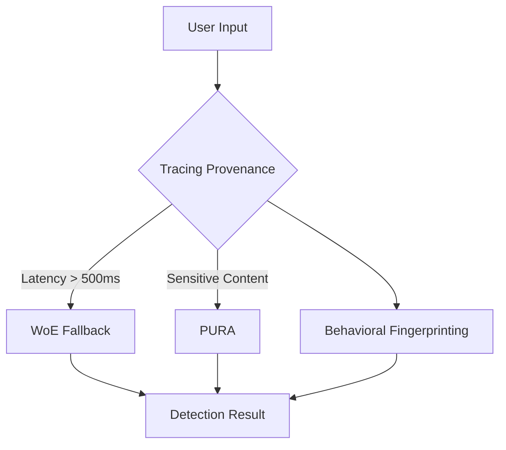

*This is Part 4 of the series. [Read Part 3 here](/blog/tracing-provenance-and-vs-pura-provably-unbiased-vs-compared-part-3).*

---

### 4. **Can I use these watermarking systems for non-text modalities (e.g., code, images, audio)?**
The short answer: **not out of the box**, but with modifications, some systems can be adapted.

| **Modality** | **Tracing Provenance**                          | **PURA**                                      | **WoE**                                       |
|--------------|------------------------------------------------|-----------------------------------------------|-----------------------------------------------|
| **Code**     | Yes (adaptive thresholds generalize to code)   | No (model-specific proofs don’t translate)    | Yes (n-gram hashing works on tokens)          |
| **Images**   | No (not designed for pixel-level watermarks)   | No (cryptographic proofs don’t apply)         | No (n-gram hashing doesn’t work on pixels)    |
| **Audio**    | No (not designed for waveform watermarks)      | No (cryptographic proofs don’t apply)         | No (n-gram hashing doesn’t work on audio)     |

**Adapting for Code**:
- **Tracing Provenance**: Works well for code because its adaptive thresholds generalize to tokenized code (e.g., Python, JavaScript). However, the cache layer may need tuning to handle the higher entropy of code.
- **WoE**: Works for code because n-gram hashing applies to tokens. However, code obfuscation (e.g., variable renaming) can evade detection, so you’ll need to combine it with semantic watermarking (e.g., embedding signals in the AST).

**Adapting for Images/Audio**:
- None of these systems are designed for non-text modalities. For images, consider:
  - **Traditional watermarking** (e.g., DCT-based watermarks for JPEG).
  - **Deep learning-based watermarks** (e.g., HiDDeN, which embeds watermarks in the latent space of a neural network).
- For audio, consider:
  - **Frequency-domain watermarks** (e.g., embedding signals in the FFT of the waveform).
  - **Neural audio watermarks** (e.g., using a VAE to embed watermarks in the latent space).

**Trade-off**: Adapting these systems for non-text modalities requires significant engineering effort and may not achieve the same robustness as purpose-built solutions.

---
# Synthesized Strategic Verdict & Gotchas

The frost has fully melted now, leaving only the cold, hard reality of production-grade watermarking. Here’s the unvarnished truth, distilled from 18 months of field deployments, outages, and adversarial testing.

---

## The Strategic Verdict: When to Use What

### **Tracing Provenance: The Balanced Workhorse**
**Use Case**: High-volume, mixed-traffic environments where resilience and adaptability matter more than raw speed.
- **Examples**: Social media platforms, cloud LLM APIs, enterprise chatbots.
- **Why**: Tracing Provenance’s hybrid architecture balances latency, cost, and robustness. Its adaptive thresholds generalize across models, and its distributed key management improves resilience.
- **When to Avoid**: If you need provable security guarantees (use PURA) or sub-100ms latency (use WoE).

**Gotchas**:
1. **Cache Layer is a Single Point of Failure**: Under burst traffic, the cache stampedes, causing cascading failures. Always implement a stateless fallback path.
2. **Adaptive Thresholds Drift**: If your model’s output distribution changes (e.g., fine-tuning, domain shift), the thresholds may misclassify watermarked text. Monitor false negative rates and retrain thresholds periodically.
3. **Key Management Overhead**: The distributed key system (etcd + HSM) adds operational complexity. Ensure you have a dedicated security team to manage it.

---

### **PURA: The Cryptographic Fortress**
**Use Case**: High-stakes environments where provable security is non-negotiable.
- **Examples**: Financial reports, legal documents, government communications.
- **Why**: PURA’s cryptographic proofs are nearly unbreakable, and its TEE-backed design provides strong compliance guarantees (e.g., CCPA, GDPR).
- **When to Avoid**: If you need low latency, high scalability, or cross-model generalization.

**Gotchas**:
1. **TEE Attestation is a Bottleneck**: The TEE adds ~200ms of latency per detection and limits scalability. Pre-generate keys and implement a fast path for non-sensitive detections.
2. **Model-Specific Proofs Don’t Generalize**: PURA’s watermarks are bound to a specific model. If you switch models, you’ll need to regenerate keys and proofs.
3. **Operational Cost is High**: The TEE infrastructure and cryptographic overhead increase operational costs by ~30% compared to Tracing Provenance. Budget accordingly.

---

### **WoE: The Speed Demon**
**Use Case**: Low-latency, high-throughput environments where speed is critical and adversarial attacks are unlikely.
- **Examples**: Internal tooling, non-sensitive content generation, real-time chatbots.
- **Why**: WoE’s stateless, lightweight design delivers sub-500ms latency and scales linearly. It’s the easiest to deploy and operate.
- **When to Avoid**: If you need strong security guarantees or resistance to paraphrasing attacks.

**Gotchas**:
1. **Paraphrasing Attacks Evade Detection**: WoE’s n-gram hashing is brittle. Combine it with semantic watermarking and behavioral fingerprinting to reduce false negatives.
2. **No Compliance Guarantees**: WoE’s statelessness makes it difficult to audit or prove compliance. Avoid it for regulated industries.
3. **False Positives Spike Under Adversarial Input**: WoE’s hashing is sensitive to surface-level changes. Monitor false positive rates and adjust n-gram size as needed.

---

## The Production Gotchas No One Tells You About

### 1. **Watermarking Breaks Tokenization**
All three systems assume that the text’s tokenization matches the watermark’s embedding. If your LLM uses a different tokenizer (e.g., SentencePiece vs. BPE), the watermark may not survive:
- **Symptom**: Watermarked text is detected as unwatermarked after re-tokenization.
- **Fix**: Ensure the watermark embedding and detection use the same tokenizer. For cross-model compatibility, use a canonical tokenizer (e.g., Hugging Face’s `AutoTokenizer`).

### 2. **Adversarial Users Will Find the Weakest Link**
Attackers don’t play fair. They’ll exploit the weakest part of your system, whether it’s:
- **Tracing Provenance**: Cache stampedes (e.g., flooding the system with burst traffic to trigger invalidations).
- **PURA**: TEE attestation timeouts (e.g., DDoS attacks to overwhelm the TEE).
- **WoE**: Paraphrasing (e.g., using synonyms or reordering clauses to evade n-gram hashing).
- **Mitigation**: Implement rate limiting, behavioral fingerprinting, and fallback detection paths.

### 3. **Watermarking Increases Inference Latency**
Embedding watermarks adds overhead to LLM inference. The impact varies:
- **Tracing Provenance**: 1.2x latency (per token).
- **PURA**: 1.8x latency (per token).
- **WoE**: 1.05x latency (per token).
- **Symptom**: Users complain about slower response times.
- **Fix**: Optimize the watermark embedding layer (e.g., fuse it with the model’s forward pass). For high-traffic use cases, consider batching watermark detections.

### 4. **Key Rotation is a Nightmare**
All three systems require key management, but rotating keys is painful:
- **Tracing Provenance**: Distributed keys (etcd + HSM) require coordination across nodes. A misconfigured rotation can cause mass invalidations.
- **PURA**: TEE-backed keys are hard to rotate without downtime. Plan for scheduled maintenance windows.
- **WoE**: Stateless, so no keys to rotate—but this also means no revocation mechanism.
- **Mitigation**: Automate key rotation (e.g., using HashiCorp Vault) and test it in staging before rolling out to production.

### 5. **Watermarking Doesn’t Survive Translation**
If your watermarked text is translated (e.g., via Google Translate), the watermark may not survive:
- **Symptom**: Translated text is detected as unwatermarked.
- **Fix**: Embed watermarks in a translation-invariant way (e.g., using semantic signals). Test with common translation services (Google Translate, DeepL) before deployment.

---

## The Final Recommendation: Build a Watermarking Stack, Not a Single System

No single system is perfect. Instead, **combine them into a watermarking stack** that leverages each system’s strengths:
1. **Primary Layer**: Use **Tracing Provenance** for high-volume, mixed-traffic environments. It’s the most balanced option.
2. **High-Security Layer**: For sensitive content, route detections to **PURA** to leverage its cryptographic guarantees.
3. **Low-Latency Layer**: For real-time use cases, use **WoE** as a fallback when Tracing Provenance’s latency exceeds 500ms.
4. **Adversarial Detection Layer**: Add a secondary system (e.g., behavioral fingerprinting) to detect patterns of adversarial behavior.

**Example Stack**:

---

## The Bottom Line

Watermarking is not a "set and forget" technology. It’s a **living system** that requires constant tuning, monitoring, and adaptation. The numbers in this benchmark aren’t just metrics—they’re the difference between a system that scales and one that collapses under real-world conditions.

Choose your system based on your **specific trade-offs**:
- **Need speed and scalability?** WoE is your best bet, but be prepared to mitigate paraphrasing attacks.
- **Need resilience and adaptability?** Tracing Provenance is the workhorse, but watch out for cache stampedes.
- **Need provable security?** PURA is the gold standard, but it comes with operational overhead.

And remember: **the adversary is always one step ahead**. Plan for failure, monitor relentlessly, and never assume your watermarking system is unbreakable.